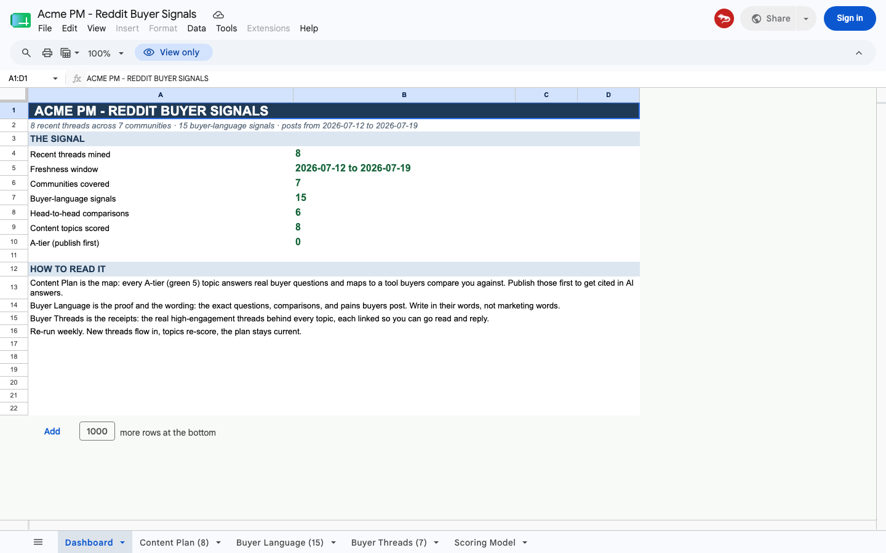
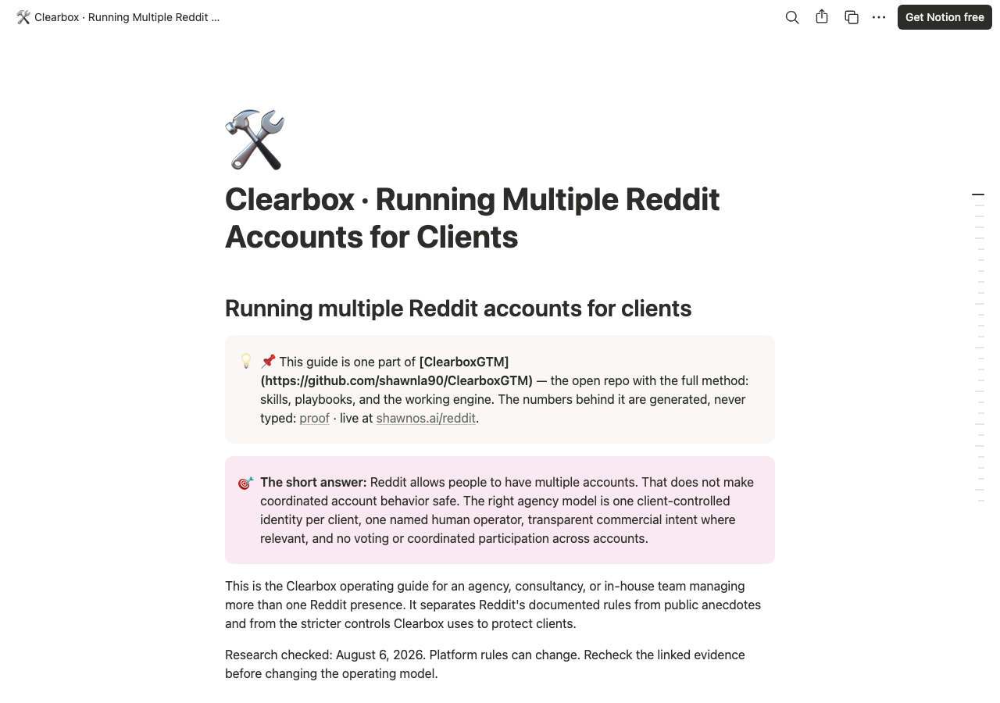

<p align="center"></p>

# ClearboxGTM

**How to win on Reddit — the skills, the engine, and the playbooks, ready for your coding agent.**

Buyers ask AI first now, and AI reads Reddit to decide what to recommend. The conversations happening in your buyers' subreddits are deciding whether you get named. This repo is the complete motion for showing up there properly: real account, real replies, and everything else automated off-platform. It is what we run for clients; it is built so you (or your agency) can run it for yours.

Open this repo in [Claude Code](https://claude.ai/code) (or Codex, or Cursor) and start with:

```
read playbooks/how-to-win-on-reddit.md and tell me where to start for <my company>
```

## The fastest start: fill the form properly

Signing up at [clearbox.to](https://clearbox.to)? Don't rush the onboarding form — Clearbox scores Reddit content against what you write in it. Paste **[`prompts/clearbox-onboarding.md`](prompts/clearbox-onboarding.md)** into your coding agent, give it your domain, and it researches your company and writes every field with sources you can check.

That interview is the most portable thing in this repo. The offer pack it produces — sourced selling points, buyer-language keywords, researched competitors, verified communities — is the context every other stage consumes, and it runs in any agent: **[`playbooks/offer-context-onboarding.md`](playbooks/offer-context-onboarding.md)**.

Running the agency motion across client accounts? Start with the public [multiple Reddit accounts operating guide](https://fierce-camelotia-1fa.notion.site/Clearbox-Running-Multiple-Reddit-Accounts-for-Clients-3b51fb92bcd78187a212de323c577399). It covers the account/workspace/operator boundary, related brands, disclosure, IP and VPN myths, coordination controls, and the measurement receipts clients can see.

## What it looks like

<p align="center"></p>

The color-coded Google Sheet: 8 content topics scored 1-5 on four dimensions (intent, demand, competitive fit, engagement), with the buyer language that backs each score, the threads you can go read and reply to, and a dashboard tab that summarizes the signal. [Run it yourself →](engine/)

<p align="center"></p>

Every client engagement ships as linked Notion docs with stable URLs — the operating guide, the command center, the playbook. [How it works →](playbooks/notion-command-center.md)

## Quick walkthrough

Clone the repo and run the offline pipeline — no API key, no Google account needed for the first run:

```bash
git clone https://github.com/shawnla90/ClearboxGTM.git
cd ClearboxGTM/engine
python3 -m venv venv && source venv/bin/activate
pip install -r requirements.txt
bash run.sh --offline
```

Expected output:

```
1/5  creating the local database...
2/5  pulling recent buyer threads from Reddit...
     offline mode: seeding from the bundled sample
     pulled 8 threads (8 relevant) across 7 subreddits
3/5  mining buyer language + content topics...
     tagged 7 threads, extracted 15 buyer-language items, built 8 content topics
4/5  scoring every content topic 1 to 5...
     scored 8 topics: 2A 3B 2C 1D
5/5  building the color-coded Google Sheet...
     (skipped: no Google OAuth token — run setup_oauth.py first)
done.
```

Connect Google Workspace (`python3 setup_oauth.py`) and re-run to get the sheet. Then point it at your own market by editing two config files: [`config/subreddits.txt`](engine/config/subreddits.txt) and [`config/keywords.txt`](engine/config/keywords.txt).

Ready to try the full, context-driven version? `open https://clearbox.to` — Clearbox classifies by buying intent, not keywords.

## What's in here

| Stage | What it does | You get | Where |
|---|---|---|---|
| **Onboard the offer** ★ | Domain in → researched offer pack out | Paste-ready blocks for the clearbox.to form, with sources | [`skills/clearbox-onboard/`](skills/clearbox-onboard/) |
| **Onboard a person** | Personalized route through the public playbook | A Notion doc with their real data and community rings | [`skills/reddit-onboard/`](skills/reddit-onboard/) |
| **Read the market** | Pull → mine → score buyer signals | Color-coded Google Sheet with A-D tiers and 4-dimension scores | [`engine/`](engine/) |
| **Engage as a human** | Value-first reply drafting | Draft comments with per-item human approval gate | [`skills/reddit-engage/`](skills/reddit-engage/) |
| **Personalize the reply** | Three-variable model for specific, tension-creating comments | Icebreaker + poke-the-bear + pain-point per reply | [`skills/personalization/`](skills/personalization/) |
| **Review company disclosure** | Exact Reddit-profile evidence first; search, thread, and handle matches stay in manual review | Verified company domain or candidate with evidence receipt | [`engine/unmask.py`](engine/unmask.py) |
| **Profile lookup** | Separate direct profile evidence, search candidates, absence, and lookup errors | Verdict, enrichment eligibility, exact URLs, domains, and bio | [`skills/profile-lookup/`](skills/profile-lookup/) |
| **Measure AI visibility** | GEO terms + live retrieval-visibility score | JSON of buyer questions with Exa retrieval status | [`skills/geo-visibility/`](skills/geo-visibility/) |
| **Win the long tail** | Buyer questions → content drafts | Blog + LinkedIn + Reddit pack with FAQ schema, drafted never posted | [`skills/longtail-content/`](skills/longtail-content/) |
| **Competitor intel** | Share of voice from classified Reddit ops | Competitor narrative with generated sentiment and openings | [`skills/competitor-intel/`](skills/competitor-intel/) |
| **Sentiment** | Three-class LLM sentiment on every opportunity | Per-op positive/neutral/negative with 1-5 score and reason | [`skills/sentiment/`](skills/sentiment/) |
| **Last 24 hours** | The morning briefing | Intent-ranked buyer signals from the last day | [`skills/last24/`](skills/last24/) |
| **Slack digest** | The daily client delivery | Slack message with engage threads, leads, competitor mentions | [`skills/slack-digest/`](skills/slack-digest/) |
| **Reddit proposals** | Pitch from buyer signals | Structured brief.json + readable BRIEF.md for a prospect | [`skills/reddit-proposal/`](skills/reddit-proposal/) |
| **Dataviz** | Reference architecture for GTM dashboards | Dark-theme Recharts palette, 3 standalone .tsx examples | [`skills/dataviz/`](skills/dataviz/) |
| **Attribution tracking** | Journey materialization pattern | First/last-touch attribution from local SQLite, no cookies | [`playbooks/attribution-tracking.md`](playbooks/attribution-tracking.md) |
| **Orchestrate enrichment** | The disclosure gate is the skill; pick your enrichment backend | Generic playbook + per-tool integration guides (Freckle, Clay, Base Loop, Deepline) | [`playbooks/orchestrate-enrichment.md`](playbooks/orchestrate-enrichment.md) |
| **Orchestrate off-platform** | Enrichment, GEO, share of voice, lead magnets, digest | Playbooks covering the full off-platform motion | [`playbooks/`](playbooks/) |
| **Sell it as a service** | The agency package | Buyer-signal sheet, deck, Notion command center | [`skills/reddit-agency/`](skills/reddit-agency/) |
| **Win the agency client** | The reverse-uno method | A readout of their buyers, not a pitch | [`playbooks/win-an-agency-client.md`](playbooks/win-an-agency-client.md) |
| **Run multiple accounts safely** | Client ownership, named operators, disclosure controls | Five-level success scorecard with evidence ledger | [`skills/reddit-agency/MULTI-ACCOUNT-OPERATIONS.md`](skills/reddit-agency/MULTI-ACCOUNT-OPERATIONS.md) |
| **Configure plans and offers** | Keep account, offer, plan, identity, operator, and payer decisions separate | Guided Plan Setup with one offer per client and client-paid offer support | [`skills/reddit-agency/MULTI-ACCOUNT-OPERATIONS.md`](skills/reddit-agency/MULTI-ACCOUNT-OPERATIONS.md) |
| **Audit quality** | 5-dimension pick-quality rubric | Score any account's picks before the client does | [`playbooks/account-quality-benchmark.md`](playbooks/account-quality-benchmark.md) |
| **API examples** | Real API responses from Exa, Firecrawl, Apollo, MoltSets | What each enrichment step produces, with and without each API | [`examples/`](examples/) |
| **Integration guides** | Step-by-step Clay, n8n, Zapier, Make setup with Mermaid diagrams | Full workflow guides with cost comparison and reasoning node patterns | [`examples/integrations/`](examples/integrations/) |
| **Workflow diagrams** | Visual node graphs for enrichment waterfall and AEO content loop | Mermaid diagrams that render on GitHub | [`examples/workflows/`](examples/workflows/) |
| **Client market read** | What a real client deliverable looks like | The triage pattern, signal/win/enter triad, delivery to Notion | [`examples/client-market-read.md`](examples/client-market-read.md) |
| **Coverage waterfall** | Identify companies, scrape, reveal, grade, deliver to Sheet | Campaign-agnostic lead-list builder (coming in v0.6.0) | *v0.6.0* |
| **Security** | The protection model | Scan gate, read-only DBs, siloed data, no auto-send | [`SECURITY.md`](SECURITY.md) |
| **Students** | Free semester of Clearbox Pro | Monthly group office hours, build-in-public track record | [`STUDENTS.md`](STUDENTS.md) |
| **Partners** | Referral and delivery tracks | Terms by email, method in the open | [`PARTNERS.md`](PARTNERS.md) |

## The playbooks

- [`how-to-win-on-reddit.md`](playbooks/how-to-win-on-reddit.md) — the thesis: do it real or not at all, karma is the currency, be natural ON Reddit and automate OFF it
- [`reddit-ai-visibility-loop.md`](playbooks/reddit-ai-visibility-loop.md) — the full open-source loop: post genuinely, AI reads Reddit, retrieval visibility compounds
- [`reddit-growth-seo.md`](playbooks/reddit-growth-seo.md) — how genuine Reddit presence compounds into organic search rankings and AI retrieval
- [`offer-context-onboarding.md`](playbooks/offer-context-onboarding.md) — the interview pattern as portable IP: offer context in, everything downstream inherits its quality
- [`automation-boundaries.md`](playbooks/automation-boundaries.md) — precisely what the machine may and may never do
- [`win-an-agency-client.md`](playbooks/win-an-agency-client.md) — the reverse-uno: show them their buyers instead of a pitch
- [`orchestrate-enrichment.md`](playbooks/orchestrate-enrichment.md) — direct profile disclosure, candidate review, retry states, and the pluggable enrichment backend
- [`orchestrate-freckle.md`](playbooks/orchestrate-freckle.md) — the Reddit-to-pipeline loop: Clearbox classifies, the disclosure gate holds, Freckle enriches, four surfaces receive
- [`orchestrate-deepline.md`](playbooks/orchestrate-deepline.md) — opportunity stream → orchestration substrate, with the trust model that keeps Reddit UGC as data, never instructions
- [`notion-command-center.md`](playbooks/notion-command-center.md) — every engagement ships as real, linked, stable documents
- [`account-quality-benchmark.md`](playbooks/account-quality-benchmark.md) — score any account's picks before the client does
- [`attribution-tracking.md`](playbooks/attribution-tracking.md) — the journey materialization pattern: first/last-touch attribution from local SQLite, no cookies, no third-party tracking

## Proof

**1.5M+** tracked views on one real account, with the karma, wins, era history, and signup-attribution tables generated straight from the tracking databases — never typed by hand. The numbers, their provenance rule, and the script that enforces it: [`proof/`](proof/). Live version at [shawnos.ai/reddit](https://shawnos.ai/reddit).

The stories behind the numbers — how genuine Reddit presence creates retrieval visibility without backlinks, and how inbound replies compound into pipeline: [`proof/stories/`](proof/stories/).

## Transparency

What actually built the user base — including what failed. The honest channel ranking, and a full postmortem of the cold-email machine that produced a handful of users despite a serious engineering investment: [`transparency/`](transparency/). The failures shaped this method as much as the wins did.

## The rules this repo will not let you break

1. **Nothing posts automatically.** Every send is a human pressing send. The automation reads, drafts, scores, and digests; it does not talk.
2. **The disclosure gate refuses to guess.** Only an exact company domain published on the author's own Reddit profile is automatically enrichment-eligible. Search, thread, and handle matches require human review.
3. **Recency is a hard gate.** Live threads only.
4. **Every claim traces to a source.** The FACTCHECK gates in the skills are not decoration; they are the post-mortems of real mistakes.
5. **Retrieval is not citation.** Exa can show that a source is retrievable. Only a captured AI answer with an exact source receipt proves that answer named or cited it.
6. **Your data stays yours.** Every database is a local SQLite file on your machine. No cookies, no shared backend, no analytics pixel. Attribution runs locally. Client workspaces are siloed by directory. See [`SECURITY.md`](SECURITY.md).

How these rules are enforced — the provenance rule, the language boundaries, and the scan gate every release passes: [`VERIFYING.md`](VERIFYING.md).

## Related

- [gtm-coding-agent](https://github.com/shawnla90/gtm-coding-agent) — the broader build-your-GTM-engine starter kit (21 chapters, 9 starters). The Reddit engine here also lives there as the `reddit-buyer-signals` starter, documented in chapters 18–19.
- [The multi-account operations guide on Notion](https://fierce-camelotia-1fa.notion.site/Clearbox-Running-Multiple-Reddit-Accounts-for-Clients-3b51fb92bcd78187a212de323c577399) — the public, shareable version of the agency operating guide
- [shawnos.ai/reddit](https://shawnos.ai/reddit) — the public playbook with live numbers
- [shawnos.ai/vault](https://shawnos.ai/vault) — the skill tree these skills publish to
- [clearbox.to](https://clearbox.to) — the product; students see [`STUDENTS.md`](STUDENTS.md), partners see [`PARTNERS.md`](PARTNERS.md)

## License

MIT. Take it, run it, run it for clients.

---

**Powered by [Clearbox](https://clearbox.to)** — see your market, move first. Clearbox reads live Reddit conversations and returns the person, the room, the timestamp, and their exact words, classified by buying intent, every day.
