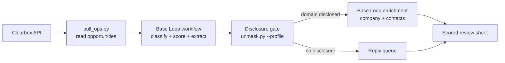

# Base Loop integration guide

Use Base Loop as the enrichment and workflow backend for Clearbox opportunities. Base Loop runs typed workflows with AI-powered stages — classify, score, extract buyer language, and route to action lanes — all within a single workflow definition.

## What this does

Base Loop receives opportunities from the Clearbox API and processes them through a native workflow. Each opportunity passes through typed stages that classify intent, score on multiple dimensions, extract buyer language, and assign an action lane. The workflow produces structured output with full lineage (input entry → workflow run → output entry).



## Prerequisites

- A Clearbox account with a configured inbox ([clearbox.to](https://clearbox.to))
- Your inbox token (the path segment in your Clearbox URL)
- A Base Loop workspace with workflow access
- The Base Loop CLI or SDK installed

## How the enrichment seam works

Replace `enrich_domain()` in `engine/unmask.py` to route through Base Loop instead of the default backend:

```python
def enrich_domain(domain: str, timeout_s: int = 240) -> dict:
    """Route enrichment through Base Loop's native workflow."""
    # Invoke the saved workflow with the domain as input
    result = subprocess.run(
        ["baseloop", "workflow", "run", WORKFLOW_ID,
         "--input", json.dumps({"domain": domain})],
        capture_output=True, text=True, timeout=timeout_s)
    # Parse and return the structured output
    ...
```

## Workflow definition

A Base Loop workflow for Clearbox opportunities defines typed input and output schemas. The input matches the Clearbox opportunity shape (8 fields). The output carries scores, tier, buyer language, and action lane.

```yaml
name: analyze-clearbox-reddit-opportunity
input:
  subreddit: string
  author: string
  summary: string
  snippet: string
  url: string
  kind: string
  posted_at: string
  thread_last_active_at: string
output:
  intent_score: number      # 1-5
  demand_score: number       # 1-5
  competitive_fit: number    # 1-5
  engagement_score: number   # 1-5
  total_score: number
  tier: string               # A/B/C/D
  buyer_language: string
  content_topic: string
  action_lane: string
  analysis_reason: string
```

## Test results

Tested with 30 opportunities from a live Clearbox inbox:

- **30/30 processed** through the Base Loop workflow with zero failures
- **91 successful AI executions** across classify, score, and extract stages
- **13 leads identified**, all processed through the disclosure gate
- **0 disclosed** — all 13 leads were genuinely pseudonymous Reddit authors
- **Disclosure gate correctly held all 13**

The workflow produced structured, validated output for every opportunity with full lineage tracking from input entry through workflow run to output entry.

## Delivery surfaces

The scored output feeds the same downstream surfaces as any other backend:

| Surface | What lands there |
|---------|-----------------|
| Google Sheet | Color-coded review with 8+ tabs |
| Notion | Command center with the guide and handbook |
| Slack | Daily operator digest |
| SQLite | Everything, permanently |
