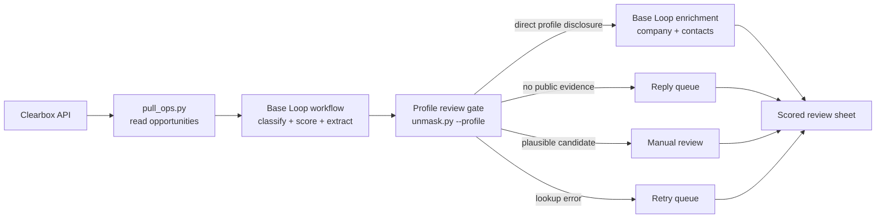

# Base Loop integration guide

Use Base Loop as the enrichment and workflow backend for Clearbox opportunities. Base Loop runs typed workflows with AI-powered stages — classify, score, extract buyer language, and route to action lanes — all within a single workflow definition.

## What this does

Base Loop receives opportunities from the Clearbox API and processes them through a native workflow. Each opportunity passes through typed stages that classify intent, score on multiple dimensions, extract buyer language, and assign an action lane. The workflow produces structured output with full lineage (input entry → workflow run → output entry).



## Prerequisites

- A Clearbox account with a configured inbox ([clearbox.to](https://clearbox.to))
- Your inbox token (the path segment in your Clearbox URL)
- A Base Loop workspace with workflow access
- The Base Loop CLI or SDK installed

## How the enrichment seam works

Replace `enrich_domain()` in `engine/unmask.py` to route through Base Loop instead of the default backend:

```python
def enrich_domain(domain: str, timeout_s: int = 240) -> dict:
    """Route enrichment through Base Loop's native workflow."""
    # Invoke the saved workflow with the domain as input
    result = subprocess.run(
        ["baseloop", "workflow", "run", WORKFLOW_ID,
         "--input", json.dumps({"domain": domain})],
        capture_output=True, text=True, timeout=timeout_s)
    # Parse and return the structured output
    ...
```

## Workflow definition

A Base Loop workflow for Clearbox opportunities defines typed input and output schemas. The input matches the Clearbox opportunity shape (8 fields). The output carries scores, tier, buyer language, and action lane.

```yaml
name: analyze-clearbox-reddit-opportunity
input:
  subreddit: string
  author: string
  summary: string
  snippet: string
  url: string
  kind: string
  posted_at: string
  thread_last_active_at: string
output:
  intent_score: number      # 1-5
  demand_score: number       # 1-5
  competitive_fit: number    # 1-5
  engagement_score: number   # 1-5
  total_score: number
  tier: string               # A/B/C/D
  buyer_language: string
  content_topic: string
  action_lane: string
  analysis_reason: string
  profile_lookup_status: string       # self_disclosed/candidate_found/no_links_found/lookup_error
  profile_review_verdict: string      # direct_disclosure/plausible_candidate/no_public_evidence/lookup_error
  enrichment_eligibility: string      # eligible_direct_disclosure/manual_review/not_eligible
  profile_evidence_urls: array[string]
```

## Verification standard

The reference workflow has been exercised on a live Clearbox inbox with structured lineage from input through classification and routing. A completed workflow run does not establish identity. Apply the same evidence states in every Base Loop workspace:

- Only an exact company domain published on the author's Reddit profile is `eligible_direct_disclosure`.
- Exa, DuckDuckGo, thread-domain, and brand-handle matches are `manual_review` candidates.
- `no_public_evidence` requires a completed Reddit-profile check; otherwise use `lookup_error`.
- Preserve the exact evidence URL, excerpt, lookup source, and review verdict in the output row.

Do not route a row into company or contact enrichment solely because an AI cell or search provider proposed a matching company.

## Delivery surfaces

The scored output feeds the same downstream surfaces as any other backend:

| Surface | What lands there |
|---------|-----------------|
| Google Sheet | Eleven-view working surface with Plan Setup, Operator Console, evidence, and measurement |
| Notion | Guided value brief that explains the value and every Sheet view |
| Slack | Daily operator digest |
| SQLite | Everything, permanently |

Export the native `rows[].cells` result and pass it to the shared builder:

```bash
python3 engine/build_client_pack.py \
  --ops data/clearbox-inbox.json \
  --analysis data/baseloop-analysis.json \
  --backend baseloop \
  --brand "Client Name" \
  --publish-sheet
```

The same contract supports Freckle and Clay. Clearbox remains authoritative for the original disposition and permalink.
