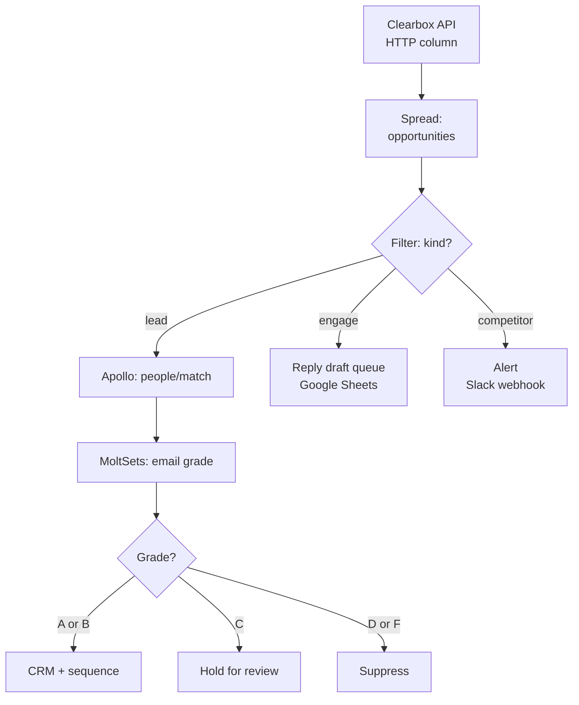

# Clay integration guide

Use the Clearbox API as an HTTP column in Clay. Each row arrives pre-classified by buying intent, so Clay enriches only the leads worth enriching instead of running blind research on every company.

## What this does

Clay pulls the Clearbox opportunity inbox via HTTP. Every row carries `kind` (lead / competitor / engage), a summary, a snippet of the buyer's exact words, and a permalink to the Reddit thread. A Filter step routes leads to enrichment and competitors to alerts. Engage ops go to a reply-drafting queue.

The cost difference is the point: one classified API call replaces dozens of speculative Clay credits.

## Prerequisites

- A Clearbox account with a configured inbox ([clearbox.to](https://clearbox.to))
- Your inbox token (the path segment in your Clearbox URL, e.g. `aBcDeFgHiJ`)
- A Clay workspace with HTTP column access
- Optional: Apollo, MoltSets, or any enrichment provider you already use in Clay

## Step-by-step setup

### 1. Create the source table

Create a new Clay table. Add a single **HTTP Enrichment** column:

| Setting | Value |
|---------|-------|
| Method | GET |
| URL | `https://api.clearbox.to/a/{YOUR_TOKEN}/inbox` |
| Headers | `User-Agent: Mozilla/5.0 (Macintosh; Intel Mac OS X 10_15_7)` |

The User-Agent header is required — Cloudflare returns 403 to default library user agents.

### 2. Parse the response

The API returns:

```json
{
  "counts": { "todo": 24, "done": 0, "total": 24 },
  "opportunities": [
    {
      "id": "18",
      "kind": "lead",
      "summary": "This author is frustrated by paywalled GTM tools...",
      "snippet": "Why does no one talk about how pay walled GTM is...",
      "author": "FamiliarEstimate6267",
      "subreddit": { "name": "gtmengineering" },
      "url": "https://www.reddit.com/r/gtmengineering/comments/...",
      "posted_at": "2026-08-08T00:55:16.000Z"
    }
  ]
}
```

Add a **Spread** column to flatten `opportunities[]` into rows. Each row becomes one opportunity with all fields accessible.

### 3. Filter by intent

Add a **Filter** step on the `kind` field:

| kind | Route to |
|------|----------|
| `lead` | Enrichment columns (Apollo, Clearbit, your waterfall) |
| `competitor` | Alert column (Slack webhook or email) |
| `engage` | Reply-draft queue (Google Sheets or your review surface) |

This filter is where the savings happen. Without it, every row burns enrichment credits. With it, only leads (typically 30-40% of the inbox) hit the paid APIs.

### 4. Enrich leads only

On the filtered lead rows, add your enrichment columns:

1. **Company enrichment** — Clearbit, Apollo org search, or Freckle workflow
2. **People match** — Apollo people/match on the author's disclosed domain (if any)
3. **Email grade** — MoltSets reverse email lookup for deliverability scoring (A-F)
4. **ICP scoring** — Your existing Clay ICP formula against the enriched data

Each column runs only on lead-classified rows. Engage and competitor rows skip these columns entirely.

### 5. Output

Add output columns to route the enriched leads:

- **CRM push** — HubSpot, Salesforce, or Attio integration for graded leads (A/B)
- **Sequence** — Outreach, Salesloft, or Smartlead for sequence-ready contacts
- **Review queue** — Google Sheets for leads that need manual review (grade C or cross-domain)

### Generate the full client value pack

Keep the Clearbox `id`, `kind`, and `url` columns in the Clay export. Add the normalized analysis columns listed in [`../../skills/reddit-agency/CLIENT-VALUE-PACK.md`](../../skills/reddit-agency/CLIENT-VALUE-PACK.md), then export the table as CSV or JSON:

```bash
python3 engine/build_client_pack.py \
  --ops data/clearbox-inbox.json \
  --analysis data/clay-analysis.csv \
  --backend clay \
  --brand "Client Name" \
  --publish-sheet
```

The result is the same eleven-view Google Sheet and guided Notion-ready brief available to the other backends. Clay adds analysis; Clearbox keeps ownership of the disposition and exact Reddit permalink.

## The workflow



## Cost comparison

The math on a real inbox with 24 opportunities (9 leads, 13 engage, 2 competitor):

### Without Clearbox (keyword-based Clay research)

| Step | Credits per row | Rows | Total credits |
|------|----------------|------|---------------|
| Company research | ~5 | 100 (estimated keyword hits) | ~500 |
| People enrichment | ~3 | 100 | ~300 |
| Email verification | ~1 | 100 | ~100 |
| **Total** | | | **~900 credits** |

Hit rate on ICP: ~15-20% (keyword matching pulls noise). ~80% of credits spent on rows that are not buyers.

### With Clearbox (intent-classified inbox)

| Step | Credits per row | Rows | Total credits |
|------|----------------|------|---------------|
| Clearbox inbox pull | 0 (flat subscription) | 1 API call | 0 |
| People enrichment | ~3 | 9 (leads only) | ~27 |
| Email verification | ~1 | 9 | ~9 |
| **Total** | | | **~36 credits** |

Hit rate on ICP: higher (intent-filtered). 100% of credits spent on classified leads.

**The multiplier:** Clearbox pre-classification reduces Clay credit burn by 60-96% depending on inbox composition. The filter step is free — the classification already happened.

## Limitations

- The Clearbox API is pull-only. There is no webhook or push notification. Set up a scheduled Clay table refresh (every 6-12 hours) to poll for new ops.
- The token is in the URL path, not a header. Do not expose the Clay table publicly.
- Ops are Reddit-sourced. Enrich the company, never the person, and only when `unmask.py --profile` returns `eligible_direct_disclosure` with exact Reddit-profile evidence. Search, thread, and handle candidates stay in manual review. See [`../../engine/unmask.py`](../../engine/unmask.py) for the gate logic.
- The public method and builder are self-serve. The operated agency offering and multi-offer enablement require contacting `partners@clearbox.to`.

## Related

- [`../README.md`](../README.md) — the API shape and all enrichment providers
- [`../../engine/README.md`](../../engine/README.md) — where the API fits in the full pipeline
- [`./n8n.md`](./n8n.md) — the n8n equivalent with reasoning nodes
- [`../../playbooks/orchestrate-freckle.md`](../../playbooks/orchestrate-freckle.md) — the full loop this plugs into
