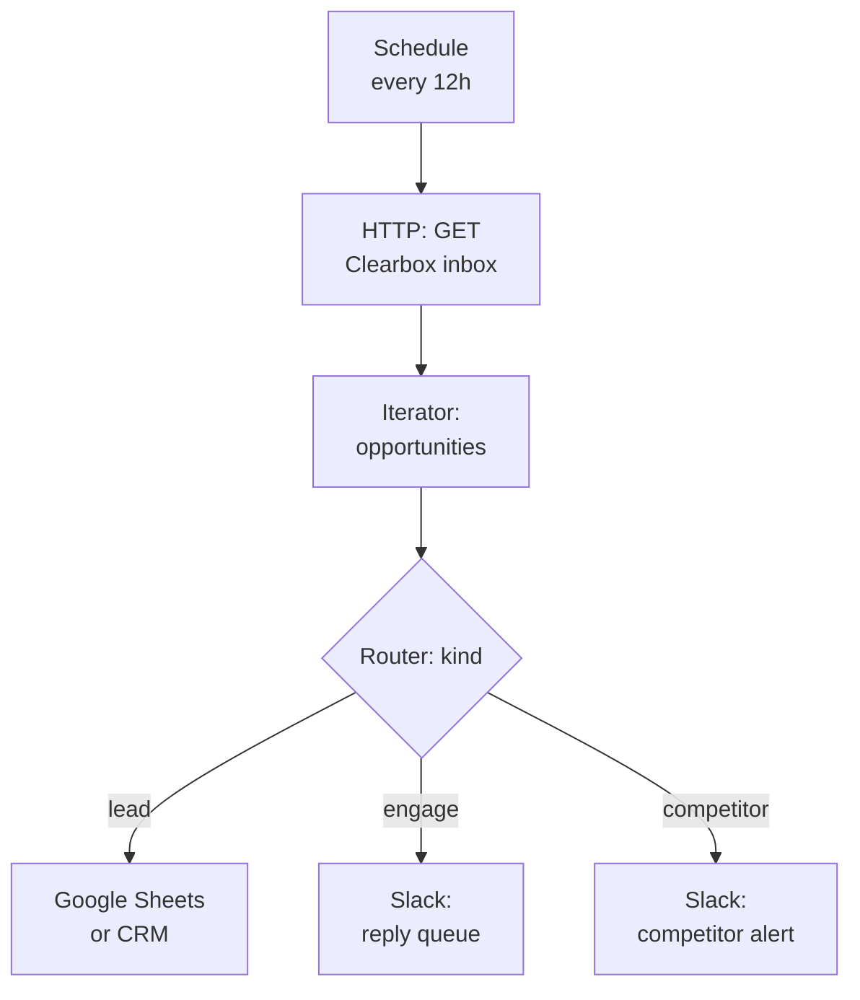

# Make (Integromat) integration guide

Pull the Clearbox inbox into a Make scenario using the HTTP module and route by intent.

## What this does

Same pattern as the n8n and Zapier integrations: scheduled HTTP GET pulls the inbox, a Router module splits by `kind`, and each branch pushes to the right destination. Make's HTTP module handles the Clearbox API without custom app modules.

## Prerequisites

- A Make account
- A Clearbox account with a configured inbox ([clearbox.to](https://clearbox.to))
- Your inbox token

## Setup

### 1. Schedule module

Set a scenario schedule: every 6-12 hours.

### 2. HTTP module: Make a request

| Setting | Value |
|---------|-------|
| Method | GET |
| URL | `https://api.clearbox.to/a/{YOUR_TOKEN}/inbox` |
| Headers | `User-Agent`: `Mozilla/5.0 (Macintosh; Intel Mac OS X 10_15_7)` |
| Parse response | Yes |

### 3. Iterator module

Add an **Iterator** on `opportunities[]` to process each op individually.

### 4. Router module

Add a **Router** with three branches:

| Branch | Filter condition | Destination |
|--------|-----------------|-------------|
| 1 | `kind` = `lead` | Google Sheets, HubSpot, or Salesforce module |
| 2 | `kind` = `engage` | Slack or Google Sheets (reply queue) |
| 3 | `kind` = `competitor` | Slack or email |

### 5. Destinations

Each branch uses standard Make modules:

- **Google Sheets: Add a Row** — map `id`, `kind`, `summary`, `subreddit.name`, `url`, `posted_at`
- **Slack: Create a Message** — post to the appropriate channel
- **HubSpot: Create a Contact/Note** — for leads matching existing CRM records

## The workflow

## Limitations

- Make's free tier allows 1,000 operations/month. A 24-op inbox polled 4x/day = ~2,880 ops/month — may require a paid plan.
- No built-in AI reasoning. For AI-generated prospect briefs, use the [n8n integration](./n8n.md) with its AI Agent node, or add an HTTP module calling the OpenAI/Anthropic API directly.
- Same pull-only API: schedule-based polling, no webhooks.

## Related

- [`./clay.md`](./clay.md) — Clay HTTP column
- [`./n8n.md`](./n8n.md) — n8n with AI reasoning
- [`./zapier.md`](./zapier.md) — Zapier equivalent
- [`../README.md`](../README.md) — API shape and enrichment providers
