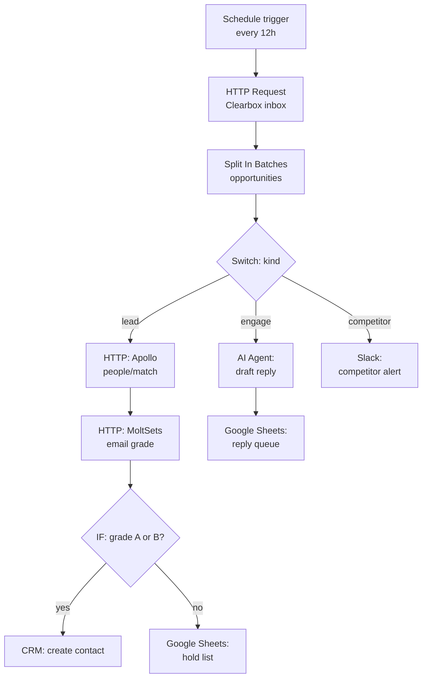
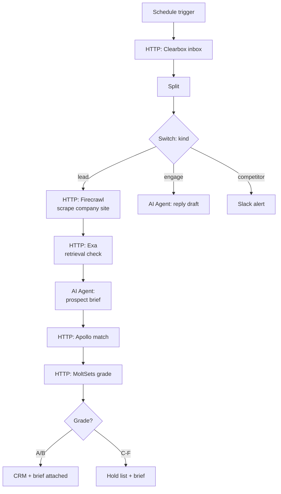

# n8n integration guide

Pull the Clearbox inbox into an n8n workflow, route by intent, and use AI reasoning nodes to build prospect briefs before a human touches anything.

## What this does

An n8n workflow that:

1. Pulls the classified opportunity inbox on a schedule
2. Routes each op by `kind` (lead / competitor / engage) using a Switch node
3. Enriches leads through Apollo and MoltSets
4. Drafts replies for engage ops using an AI Agent node
5. Alerts on competitor mentions via Slack

The reasoning node angle is the differentiator: n8n's AI Agent can take Clearbox classification + Firecrawl site data + Exa retrieval scores and build a full prospect brief from pre-classified intent data.

## Prerequisites

- n8n instance (self-hosted or cloud)
- A Clearbox account with a configured inbox ([clearbox.to](https://clearbox.to))
- Your inbox token (path segment in your Clearbox URL)
- Optional: Apollo API key, MoltSets API key, Slack webhook, OpenAI or Anthropic API key for the AI Agent node

## Step-by-step setup

### 1. Schedule trigger

Add a **Schedule Trigger** node. Set it to run every 6-12 hours. The Clearbox inbox updates in real time, but polling more than twice a day wastes runs on the same ops.

### 2. HTTP Request: pull the inbox

Add an **HTTP Request** node:

| Setting | Value |
|---------|-------|
| Method | GET |
| URL | `https://api.clearbox.to/a/{YOUR_TOKEN}/inbox` |
| Headers | `User-Agent`: `Mozilla/5.0 (Macintosh; Intel Mac OS X 10_15_7)` |
| Response Format | JSON |

The User-Agent header is required — Cloudflare returns 403 to default n8n user agents.

### 3. Split the opportunities

Add a **Split In Batches** node (or **Item Lists** > **Split Out Items**) on `$.opportunities`. Each downstream node processes one opportunity at a time.

### 4. Switch node: route by intent

Add a **Switch** node on `$.kind`:

| Output | Condition | Route to |
|--------|-----------|----------|
| 0 | `kind` equals `lead` | Lead enrichment branch |
| 1 | `kind` equals `engage` | Reply draft branch |
| 2 | `kind` equals `competitor` | Alert branch |

### 5. Lead branch: enrich and grade

**Apollo people/match** — HTTP Request node:

```
POST https://api.apollo.io/api/v1/people/match
Body: {
  "linkedin_url": "[from disclosure gate, if available]",
  "organization_name": "[from summary/snippet parsing]"
}
Headers: X-Api-Key: [your Apollo key]
```

**MoltSets email grade** — HTTP Request node:

```
GET https://api.moltsets.com/api/v1/reverse_email_lookup?email=[apollo_email]
Headers: Authorization: Bearer [your MoltSets key]
```

**IF node** — grade A or B:

| Output | Condition | Route to |
|--------|-----------|----------|
| true | `grade` in `[A, B]` | CRM create (HubSpot, Salesforce, Attio) |
| false | `grade` in `[C, D, F]` | Google Sheets hold list |

### 6. Engage branch: AI Agent reply draft

This is the move. Add an **AI Agent** node (requires an LLM API key):

**System prompt:**

```
You are a Reddit reply assistant. You draft value-first replies to
Reddit threads. Rules:
- Answer the question first. Product mention comes last, if at all.
- One paragraph. No bullet points, no headers.
- Write for the 50 silent readers, not just the OP.
- Disclose affiliation in every reply.
- Never be promotional. Be helpful.
```

**User prompt (templated from the op fields):**

```
Thread: {{$json.url}}
Subreddit: r/{{$json.subreddit.name}}
What they said: {{$json.snippet}}
Classification: {{$json.kind}} — {{$json.summary}}

Draft a reply.
```

Route the output to a **Google Sheets** node (your reply review queue). A human reads and posts — the AI drafts, it does not send.

### 7. Competitor branch: Slack alert

Add a **Slack** node:

| Setting | Value |
|---------|-------|
| Channel | `#competitor-watch` |
| Message | `Competitor mention in r/{{$json.subreddit.name}}: {{$json.summary}}\n{{$json.url}}` |

### 8. Advanced: reasoning node with multi-source context

For the highest-value leads, layer in additional data sources before the AI Agent:

1. **Firecrawl** — HTTP Request to `https://api.firecrawl.dev/v1/scrape` with the company's domain. Returns the full site as structured markdown.
2. **Exa** — HTTP Request to `https://api.exa.ai/search` with a buyer question from the thread. Returns retrieval visibility data.

Feed all three signals into the AI Agent:

```
Reddit signal: {{$json.summary}}
Company site (Firecrawl): {{$node["Firecrawl"].json.markdown}}
Retrieval visibility (Exa): {{$node["Exa"].json.results}}

Given this buyer's Reddit signal, their company's public site, and
whether they currently surface in AI search results, write a 3-sentence
prospect brief for the SDR. Include: what they need, why they need it
now, and one specific opening line for the first touch.
```

This is the pattern: Clearbox classifies the intent, Firecrawl provides the company context, Exa provides the visibility gap, and n8n's reasoning node synthesizes a brief that would take an SDR 30 minutes to research manually.

## The workflow



### With reasoning node (advanced)



## Limitations

- The Clearbox API is pull-only (GET). n8n's Schedule Trigger is the polling mechanism — there is no webhook to push new ops.
- The AI Agent node requires an LLM API key (OpenAI, Anthropic, or any provider n8n supports). Drafts are never sent automatically.
- The disclosure gate runs in the Clearbox classification. For leads without a self-disclosed company, the enrichment branch will not have a domain to enrich — route those to the reply queue instead.

## Related

- [`./clay.md`](./clay.md) — the Clay HTTP column equivalent
- [`./zapier.md`](./zapier.md) — the Zapier webhook pattern
- [`../README.md`](../README.md) — API shape and all enrichment providers
- [`../../engine/README.md`](../../engine/README.md) — where this fits in the full pipeline
