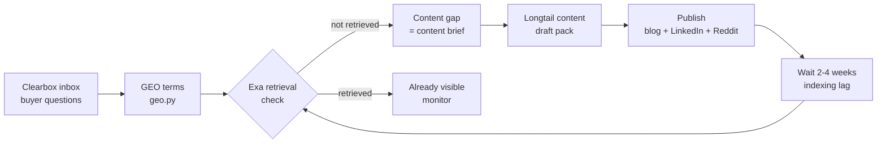

# AEO content loop

Answer Engine Optimization: the cycle that turns Clearbox buyer signals into content that surfaces in AI search results.

## The loop

## How it works

### 1. Extract buyer questions (Clearbox)

The classified ops carry the buyer's exact language — what they asked, in their words, in a real conversation. These are not brainstormed keywords. They are the questions real buyers typed.

The `mine.py` script extracts buyer language and content topics from classified ops. The topics become the GEO term candidates.

### 2. Check retrieval visibility (Exa)

`geo.py` takes the buyer questions and checks whether the brand surfaces when someone asks. Exa's `/search` endpoint returns an independent result set — not an AI answer, but a retrieval indicator.

The output for each term:
- `currently_retrieved_by_exa: "yes"` — the brand surfaces. Monitor, do not create new content.
- `currently_retrieved_by_exa: "no"` — the brand does not surface. This is the content brief.
- `currently_retrieved_by_exa: "not checked"` — no Exa API key. The term is still valid, check manually.

### 3. Draft content for the gaps (longtail-content skill)

Each gap becomes a content brief fed to the `longtail-content` skill. The skill produces a three-draft pack:

- **Blog post** — long-form answer to the buyer question with FAQ schema
- **LinkedIn post** — hook + compressed insight for the feed
- **Reddit comment draft** — value-first reply for the next time this question appears

Every draft traces to the original buyer question and the Reddit thread it came from.

### 4. Publish and wait

Content publishes through the normal channels (blog, LinkedIn, Reddit). The indexing lag is 2-4 weeks for most search engines and AI training data pipelines. After the lag, re-run the Exa check to see if the new content surfaces.

### 5. Close the loop

The re-check either confirms visibility (the content worked) or reveals a persistent gap (the content needs adjustment — more specific, better sourced, or in a higher-authority venue).

Over time, the loop compounds: more content on buyer questions → more retrieval visibility → more AI citations → more inbound from people who found the brand through an AI answer.

## What this is not

This loop measures **retrieval visibility**, not **AI citation**. Retrieval means the brand is findable in Exa's index for a buyer question. Citation means an AI answer engine (ChatGPT, Claude, Perplexity, Google AI Overview) actually named or quoted the brand in a generated answer.

Proving citation requires a receipt: a captured AI answer with the brand named, recorded with its exact source. The receipt method is documented in [`../../skills/reddit-agency/AI-VISIBILITY-SCORECARD.csv`](../../skills/reddit-agency/AI-VISIBILITY-SCORECARD.csv).

## Related

- [`../../skills/geo-visibility/`](../../skills/geo-visibility/) — the GEO terms skill
- [`../../skills/geo-visibility/EXA-GUIDE.md`](../../skills/geo-visibility/EXA-GUIDE.md) — the Exa integration guide
- [`../../skills/longtail-content/`](../../skills/longtail-content/) — the content drafting skill
- [`../../playbooks/reddit-ai-visibility-loop.md`](../../playbooks/reddit-ai-visibility-loop.md) — the full open-source loop playbook
