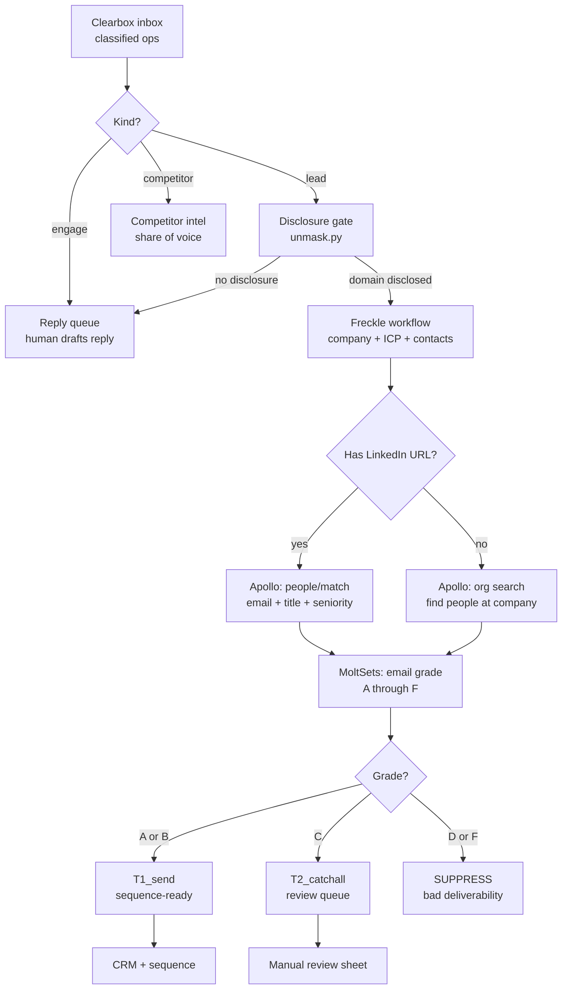

# Enrichment waterfall

The full path from a classified Clearbox op to a sequence-ready contact. Every step is optional and degrades gracefully — the waterfall runs whatever stages have API keys configured and skips the rest.

## The flow

## What each step does

| Step | Tool | Input | Output | Without it |
|------|------|-------|--------|-----------|
| Classify | Clearbox | Subreddit config | Ops with `kind` and `summary` | Use RapidAPI keyword matching (noisier) |
| Disclosure gate | `unmask.py` | Op summary + snippet | `disclosed: true/false` + domain | No enrichment path |
| Company enrich | Freckle CLI | Domain | Company name, ICP tier, contacts | Swap for Clay or Apollo org search |
| People match | Apollo API | LinkedIn URL or company name | Email, title, seniority | No email enrichment |
| Email grade | MoltSets API | Email address | Grade A-F, catchall flag | Send without grading |
| Classify result | `coverage_waterfall.py` | Email + grade + domain | T1/T2/HOLD/SUPPRESS | Manual review of every lead |

## The disclosure gate

The gate is the critical step. It runs before any enrichment and checks three signals:

1. **Company domain in thread** — the author mentioned `acme.com` in their post or comment
2. **Site link** — the author linked to a company website
3. **Brand handle** — the author's Reddit username ends with `-ai`, `-io`, `-hq`, `labs`, `software`, etc.

When none of these signals are present, the thread stays a Reddit conversation and a human reply is the correct move. Those threads are the larger part of the work and where the account grows.

Real numbers from a live run across 720 leads in four client corpora: **1.25% disclosure rate**. The gate holding at ~1% is the point — everything else stays human.

## The pluggable seam

The `freckle_enrich()` function in `engine/unmask.py` (line 69) is the one function to swap. Replace it with:

- **Clay** — HTTP Request to a Clay table that returns enrichment
- **Apollo** — Direct API call to `people/match` or `organizations/enrich`
- **Your own waterfall** — Any sequence of enrichment calls

The gate stays the same regardless of the enrichment backend.

## Related

- [`../../engine/unmask.py`](../../engine/unmask.py) — the disclosure gate and Freckle integration
- [`../../playbooks/orchestrate-freckle.md`](../../playbooks/orchestrate-freckle.md) — the full pipeline
- [`../integrations/clay.md`](../integrations/clay.md) — Clay HTTP column integration
- [`../integrations/n8n.md`](../integrations/n8n.md) — n8n flow with enrichment branch
