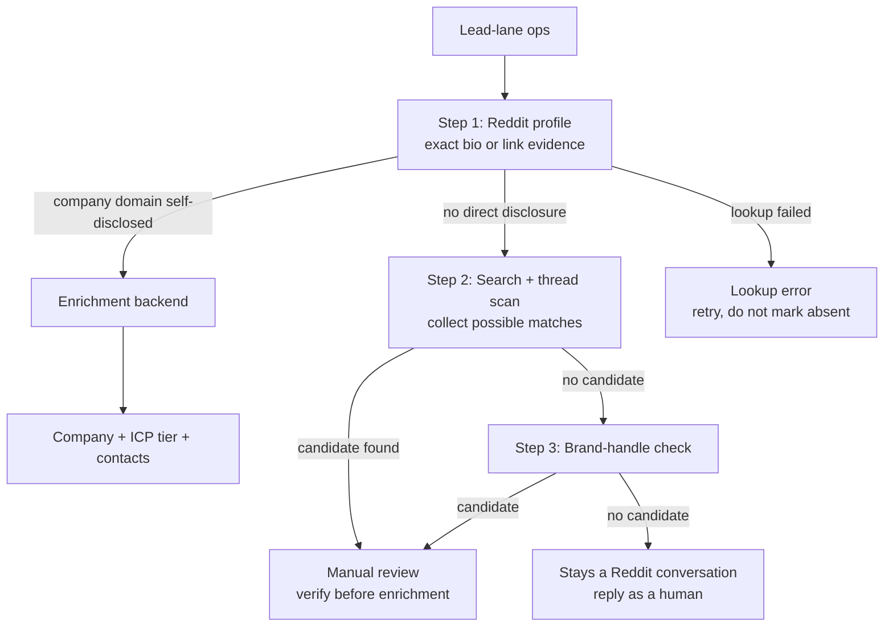

# Orchestrating the enrichment waterfall

> The disclosure gate and profile lookup are the skill. The enrichment backend is your choice.

This playbook describes the pattern that stays the same regardless of which orchestration tool you use. The gate decides *whether* to enrich. Your tool decides *how*.

## The three-step gate



Step 1 checks the author's own Reddit profile. A company domain published there, preserved with the exact profile URL and excerpt, is direct disclosure. If the profile does not reveal a company, Exa and DuckDuckGo may find possible pages tied to the username. Those search results are candidates, not disclosure.

Step 2 also scans the thread for company domains, but a domain mention may describe a vendor or competitor, so it remains a candidate. Step 3 treats a brand-like username the same way. A reviewer must verify either candidate before any enrichment.

When none of the three steps finds a company, the lead stays a Reddit conversation. A human reply is the correct move, and those threads are where an account actually grows.

## The enrichment seam

Only when the gate returns `enrichment_eligibility: eligible_direct_disclosure` does it pass a domain to `enrich_domain()` in `engine/unmask.py`. This is the single swap point — replace it with whatever orchestration tool you run:

```python
def enrich_domain(domain: str, timeout_s: int = 240) -> dict:
    """Pluggable seam: swap this for your orchestration tool."""
    # Default: Freckle CLI
    # Alternatives: Clay HTTP, Base Loop workflow, Deepline provider, Apollo direct
    ...
```

## Integration guides

Each orchestration tool has its own guide showing how it plugs into this seam:

- **Freckle** — saved workflow invocation via CLI. Full playbook: [`orchestrate-freckle.md`](orchestrate-freckle.md)
- **Deepline** — orchestration substrate with provider registry and spend caps. Full playbook: [`orchestrate-deepline.md`](orchestrate-deepline.md)
- **Clay** — HTTP column pulling the Clearbox API, with enrichment routed by kind. Guide: [`../examples/integrations/clay.md`](../examples/integrations/clay.md)
- **Base Loop** — native workflow with typed input/output and AI-powered stages. Guide: [`../examples/integrations/baseloop.md`](../examples/integrations/baseloop.md)

## Running it

```bash
cd engine

# Gate only — no external calls, shows thread/handle candidates
python3 unmask.py --ops data/ops_classified.json --out data/unmasked.json

# Gate with profile lookup — separates direct profile evidence, candidates, absence, and errors
python3 unmask.py --ops data/ops_classified.json --profile --out data/unmasked.json

# Gate + profile lookup + live enrichment through your backend
python3 unmask.py --ops data/ops_classified.json --profile --enrich --out data/unmasked.json
```

## Gate output

- `direct_disclosure`: exact Reddit-profile evidence plus a company domain; enrichment eligible.
- `plausible_candidate`: search, thread-domain, or brand-handle evidence; manual review only.
- `no_public_evidence`: a Reddit-profile tier completed without evidence.
- `lookup_error`: no Reddit-profile tier completed; retry rather than report absence.

Each direct or candidate result preserves exact evidence URLs and excerpts. Everything not directly disclosed stays out of automatic enrichment.

## The rules

1. **The gate refuses to guess.** Only exact evidence on the author's Reddit profile is direct disclosure. Search, thread, and handle matches require review.
2. **Enrich the company, never the person.** The enrichment backend receives a domain, not a name.
3. **Never enrich without `--enrich`.** The default run is gate-only with zero external calls.
4. **Profile lookup is opt-in.** Pass `--profile` to enable it. Without the flag, only the in-thread scan and brand-handle check run.
