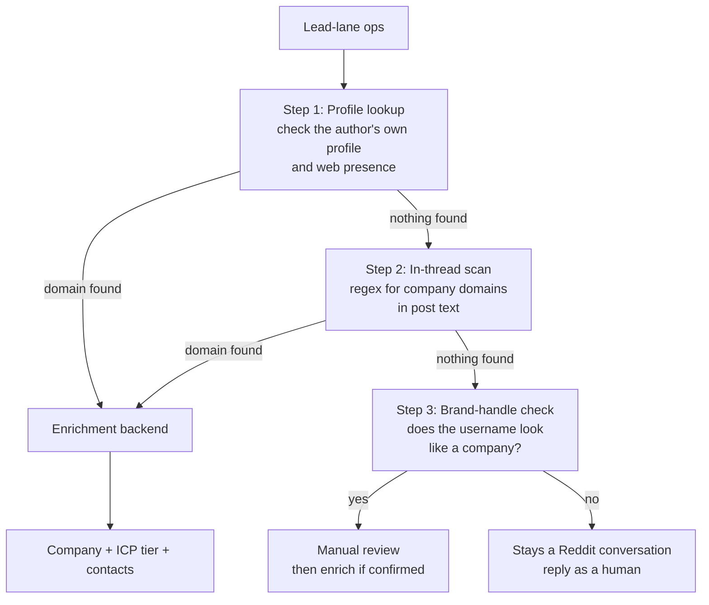

# Orchestrating the enrichment waterfall

> The disclosure gate and profile lookup are the skill. The enrichment backend is your choice.

This playbook describes the pattern that stays the same regardless of which orchestration tool you use. The gate decides *whether* to enrich. Your tool decides *how*.

## The three-step gate



Step 1 checks the person's own profile first, because that is where disclosure is most likely. If the Reddit profile has a company in the bio, a website link, or social links — that is a disclosed domain. If the profile does not reveal anything, Exa and DuckDuckGo search the username across the web to find company blogs, LinkedIn profiles, or personal sites tied to it.

Step 2 scans the thread text for company domains. Step 3 checks if the username itself looks like a brand handle.

When none of the three steps finds a company, the lead stays a Reddit conversation. A human reply is the correct move, and those threads are where an account actually grows.

## The enrichment seam

When the gate finds a domain, it passes to the `enrich_domain()` function in `engine/unmask.py`. This is the single swap point — replace it with whatever orchestration tool you run:

```python
def enrich_domain(domain: str, timeout_s: int = 240) -> dict:
    """Pluggable seam: swap this for your orchestration tool."""
    # Default: Freckle CLI
    # Alternatives: Clay HTTP, Base Loop workflow, Deepline provider, Apollo direct
    ...
```

## Integration guides

Each orchestration tool has its own guide showing how it plugs into this seam:

- **Freckle** — saved workflow invocation via CLI. Full playbook: [`orchestrate-freckle.md`](orchestrate-freckle.md)
- **Deepline** — orchestration substrate with provider registry and spend caps. Full playbook: [`orchestrate-deepline.md`](orchestrate-deepline.md)
- **Clay** — HTTP column pulling the Clearbox API, with enrichment routed by kind. Guide: [`../examples/integrations/clay.md`](../examples/integrations/clay.md)
- **Base Loop** — native workflow with typed input/output and AI-powered stages. Guide: [`../examples/integrations/baseloop.md`](../examples/integrations/baseloop.md)

## Running it

```bash
cd engine

# Gate only — no external calls, shows who disclosed
python3 unmask.py --ops data/ops_classified.json --out data/unmasked.json

# Gate with profile lookup — adds web search for each author's public identity
python3 unmask.py --ops data/ops_classified.json --profile --out data/unmasked.json

# Gate + profile lookup + live enrichment through your backend
python3 unmask.py --ops data/ops_classified.json --profile --enrich --out data/unmasked.json
```

## What the gate holds

Real numbers from live runs across several client corpora:

- **474 leads processed** across 6 accounts
- **7 company domains voluntarily disclosed** (1.25% via in-thread scan + brand handle)
- **1 additional disclosure found via profile lookup** (twot0n3 → mpiresolutions.com, found by Exa searching the username and finding a company blog)
- **467 correctly held** as pseudonymous Reddit authors

The gate holding at ~1-2% is the point. Everything else stays a human conversation.

## The rules

1. **The gate refuses to guess.** It reads what the author volunteered. It does not infer identity from writing style, posting patterns, or timezone.
2. **Enrich the company, never the person.** The enrichment backend receives a domain, not a name.
3. **Never enrich without `--enrich`.** The default run is gate-only with zero external calls.
4. **Profile lookup is opt-in.** Pass `--profile` to enable it. Without the flag, only the in-thread scan and brand-handle check run.
