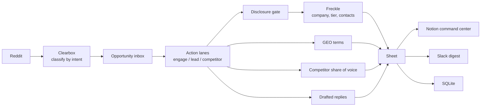

# The Reddit-to-pipeline playbook (Clearbox + Freckle)

> 🎯 This is the whole system in one page: how buyer conversations get read, how the ones worth a reply get worked, and how it all gets published to a Sheet, a Notion page, a Slack channel, and a database you own. Nothing here is theory; it all runs daily.

## The loop

Five plays hang off that spine. Each one is a script in `../engine/` you can read, run, and change.

## What Clearbox is doing

Clearbox reads live conversations and returns four things together: the person, the room they said it in, the timestamp, and their exact words.

That combination is the product. A buyer describing the problem in their own language, in public, while they are still describing it, is the earliest usable signal in go-to-market. It arrives before a form fill, before a demo request, before the term shows up in a keyword tool.

> ⚡ Once you have the person, the room, the timestamp and the quote, every downstream job gets easier. The enrichment knows who to look up. The content knows what language to use. The reply writes itself, and it is true.

## Play 1: read the room

`pull.py` and `mine.py` collect threads from the subreddits that matter to a given business. `score.py` sorts them into action lanes:

| Lane | What it means | What you do |
|---|---|---|
| Engage | Someone described a problem you solve | Reply as a person, in the thread |
| Lead | Someone is shopping, comparing, or asking for a recommendation | Work it |
| Competitor | A competitor was named or recommended | Read it, answer the objection in content |

Recency is a hard gate, not a preference. The default window is the last 30 days. You engage with live threads, which is how an account grows on Reddit instead of getting flagged.

## Play 2: resolve who it is

This is one hop, and it is optional.

Reddit is pseudonymous by design, and the gate respects that. It reads what an author already tied to a company in public, in the thread. Three signals count: they named a company, they linked a site, or they post under a brand handle. When one of those is present, the domain goes to Freckle, which returns the company, an ICP tier, and contacts.

When none of them is present, the thread stays a conversation, and a human reply is the correct move. Those threads are the larger part of the work and they are where the account actually grows.

`unmask.py` does this. Freckle is the default enrichment backend, and the documented alternative is to swap it for Clay, Apollo, or your own waterfall. The gate is the part worth copying. The enrichment behind it is a choice.

> 🔴 The gate refuses to guess. That is the whole design. A system that infers an identity from a handle is the kind of system that gets a category regulated, and it produces contacts nobody can act on with a straight face.

**Real numbers from a live run of this gate** (720 leads across several client corpora): 1.25% of lead-lane authors had self-disclosed a company by one of the three signals. Of the disclosed domains, the enrichment waterfall resolved 44.3% to a full company record, 35.7% to a partial record, 24.3% to contacts, and 7.1% missed entirely. The gate holding at ~1% is the point: everything else stays a human conversation.

Freckle also runs the other direction, on signups: a person arrives with a free email address and nothing else; the workflow resolves the profile, scores the company, and drafts the first message, with fallbacks at each step so one miss does not kill the run.

## Play 3: the questions you should be the answer to

`geo.py` derives the buyer questions a brand should surface for, taken from the real language in the opportunity set rather than a keyword tool. Then it checks whether the brand currently appears when someone asks.

Every term carries a `buyer_evidence` field that traces back to the actual thread text, so nothing in the output is a generated guess. The gap between the questions being asked and the questions you answer is the content plan, and it comes with receipts attached. (In one client run: visibility 0 of 8 on the GEO terms that mattered. That gap was the whole engagement.)

## Play 4: competitor share of voice and sentiment

`competitor.py` reads the same set and asks two things. Where is a competitor already the relevant answer, and what is the emotional temperature of the conversation.

The sentiment read is an LLM pass over the thread summaries, and it is labelled that way in the output. Where the negative cluster concentrates is usually a single specific objection, and a specific objection is a content brief. (Same client run: the brand was the relevant answer in 2 of 73 competitor-lane threads. A number like that closes deals for the service that fixes it.)

## Play 5: the daily Slack digest

This is where the loop stops being a report and becomes work.

One message lands each morning: the threads to reply to with a draft already written, the new leads, and the competitor mentions, ordered by priority. Each row carries why it surfaced, the suggested reply, and a direct link to the thread.

> 🔴 Nothing in this system sends on its own. The digest is a review surface an operator acts from. Every send is a human pressing send.

## What it writes to

| Surface | What lands there | Who reads it |
|---|---|---|
| Google Sheet | Buyer threads, buyer language, content plan, scoring model, dashboard | The operator working the list |
| Notion | Command center, operator handbook, content studio | The client or the team |
| Slack | The daily digest | Whoever is replying today |
| SQLite | Everything, permanently | You, and any script you write later |

The database is the part people skip and then regret skipping. Owning the rows means the analysis is repeatable, the numbers can be regenerated instead of remembered, and you are never asking a vendor to export your own history back to you.

## Where each stage runs

| Stage | Runs on |
|---|---|
| Reddit ingestion and intent classification | Clearbox |
| Action-lane triage | Local Python |
| Disclosure gate | Local Python |
| Company enrichment, ICP tier, contacts | Freckle |
| Signup person resolution and copy drafting | Freckle |
| GEO terms and retrieval visibility | Local Python plus Exa. Confirm AI mentions and citations separately with answer receipts. |
| Competitor share of voice and sentiment | Local Python plus LLM |
| Content drafting | Local Python plus LLM |
| Sheet, Notion, Slack delivery | Local Python |

Freckle owns two hops. The rest runs locally. The stages worth moving to a research agent first are the GEO and competitor passes, since both are a typed result over a stable input shape.

> 🎯 See your market. Move first. — [clearbox.to](https://clearbox.to)
